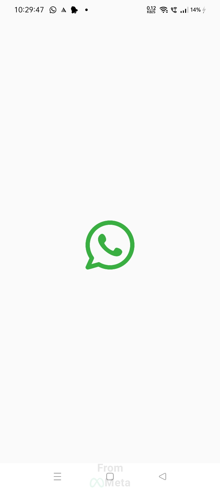
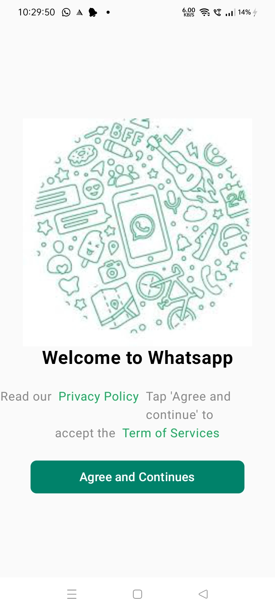
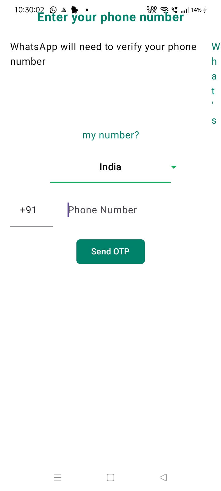

# 📱 WhatsApp Clone

A WhatsApp Clone built using Kotlin, Jetpack Compose, Firebase Authentication, Hilt, and MVVM Architecture.

## ✨ Features

- Splash Screen
- Welcome Screen
- Phone Number Authentication
- OTP Verification
- Basic Profile Setup
- Image Picker

## 🛠️ Tech Stack

- Kotlin
- Jetpack Compose
- Firebase Authentication
- Hilt
- MVVM
- Navigation Compose

## 📱 Screenshots

| Splash Screen | Welcome Screen | Phone Authentication |
|---------------|----------------|----------------------|
|  |  |  |

## 📚 Project Overview

This project was created to practice Android development using Kotlin, Jetpack Compose, Firebase Authentication, Hilt, and the MVVM architecture. It demonstrates the implementation of user authentication and basic profile setup.

## 👨‍💻 Author

Tejas Kadam
